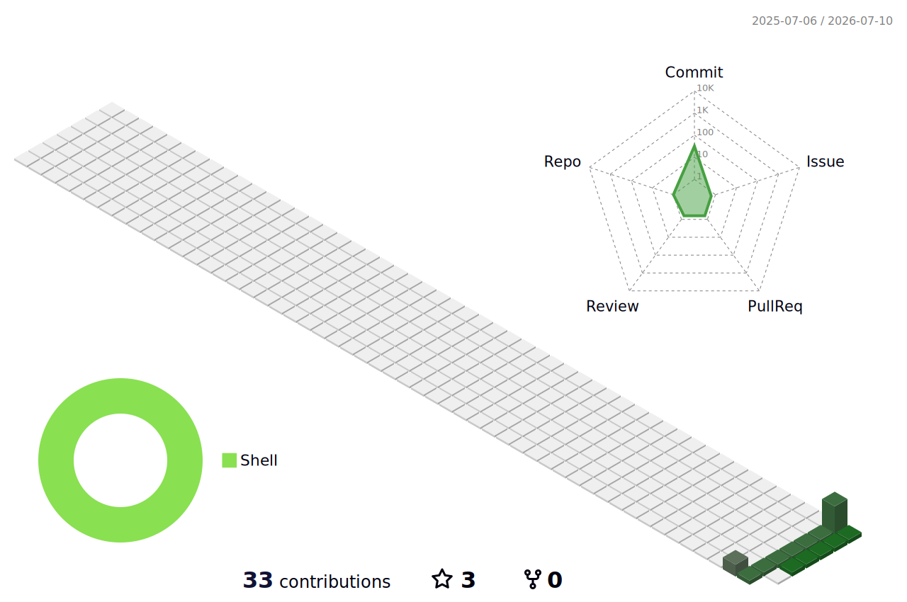
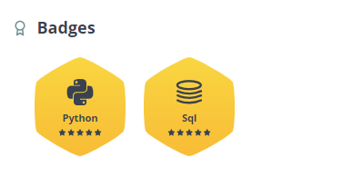

## Hi there 👋

<!--
**X-OH/X-OH** is a ✨ _special_ ✨ repository because its `README.md` (this file) appears on your GitHub profile.

Here are some ideas to get you started:

- 🔭 I’m currently working on ...
- 🌱 I’m currently learning ...
- 👯 I’m looking to collaborate on ...
- 🤔 I’m looking for help with ...
- 💬 Ask me about ...
- 📫 How to reach me: ...
- 😄 Pronouns: ...
- ⚡ Fun fact: ...
-->

<p align="center">
    <!-- https://github.com/kyechan99/capsule-render -->
    
</p>
<p align="center">
    <!-- https://github.com/DenverCoder1/readme-typing-svg -->
    
</p>
<p align="center">
    <!-- https://github.com/anuraghazra/github-readme-stats -->
    <!-- rules: https://github.com/anuraghazra/github-readme-stats/blob/master/src/calculateRank.js -->
    
    <!-- https://github.com/DenverCoder1/github-readme-streak-stats -->
    <!--  -->
    <!-- self-host in Vercel -->
    
</p>
<p align="center">
    <!-- https://github.com/Ashutosh00710/github-readme-activity-graph -->
    
</p>
<p align="center">
    <!-- https://github.com/ryo-ma/github-profile-trophy -->
    <!-- rules: https://github.com/ryo-ma/github-profile-trophy/blob/master/src/trophy.ts -->
    <!--  -->
    <!-- self-host in Vercel -->
    
</p>
<p align="center">
    <!-- https://github.com/LelouchFR/skill-icons -->
    
</p>
<p align="center">
    <!-- https://github.com/badges/shields --> 
    <a href="https://github.com/X-OH"></a>
    <a href="https://gitee.com/X-OH"></a>
    <a href="https://space.bilibili.com/498105668"></a>
    <a href="https://wakatime.com/@X-OH"></a>
    <!-- https://github.com/antonkomarev/github-profile-views-counter -->
    <a href="https://github.com/X-OH"></a>
</p>
<p align="center">
    <!-- https://github.com/kyechan99/capsule-render -->
    
</p>


<!--   my-icons -->
<p align="center">
    <a href="https://github.com/X-OH/X-OH"></a>
    <a href="https://github.com/python/cpython"></a>
    <a href="https://github.com/X-OH/X-OH/graphs/contributors"></a>
    <a href="https://github.com/X-OH/X-OH/stargazers"></a>
    <a href="https://github.com/X-OH/X-OH/network/members"></a>
       
</p>

<!--   my-header-img -->

<a href="https://www.python.org/"></a>


<!--   my-ticker -->    
[](https://git.io/typing-svg)


<a href="https://tryhackme.com/signup?referrer=6606c6ff813081fdb556602e"></a>


<!--   my-kaggle     
### My achievements on [kaggle](https://www.kaggle.com/andrej0marinchenko):


-->


<!--   my-skils -->

| Property                                        | Data                                                                                                                                                                                                                                                                                                                                                                                                                                                                                                                                                                                                                                                                                                                                                                                                                                                                                                                                                                                                                                                                                                                                                                                                                                                                                                                                                                                                                                                                                                                                                                                                                                                                                                                                                                                                                                                                                                                                                                  |
|-------------------------------------------------|-----------------------------------------------------------------------------------------------------------------------------------------------------------------------------------------------------------------------------------------------------------------------------------------------------------------------------------------------------------------------------------------------------------------------------------------------------------------------------------------------------------------------------------------------------------------------------------------------------------------------------------------------------------------------------------------------------------------------------------------------------------------------------------------------------------------------------------------------------------------------------------------------------------------------------------------------------------------------------------------------------------------------------------------------------------------------------------------------------------------------------------------------------------------------------------------------------------------------------------------------------------------------------------------------------------------------------------------------------------------------------------------------------------------------------------------------------------------------------------------------------------------------------------------------------------------------------------------------------------------------------------------------------------------------------------------------------------------------------------------------------------------------------------------------------------------------------------------------------------------------------------------------------------------------------------------------------------------------|
| **Language / IDE**                              |     &nbsp; &nbsp; &nbsp; &nbsp;                                                                                                                                                                                                                                                                                                                                                                                                                                                                                                                                                                                                                                                                                                                                                                                                                                                                                                                                                                                                                                                                                                                                                                                                                                                                                                    |
| **Domain Knownledge**                           | [](https://github.com/X-OH/X-OH) [](https://github.com/search?q=user%3AX-OH&type=Repositories) [](https://github.com/search?q=user%3AX-OH&type=Repositories) [](https://github.com/search?q=user%3AX-OH&type=Repositories)                                                                                                                                                                                                                                                                                                                                                                                                                                                                                                                                                                                                                                                                                                                                                                                                                                                                                                                                                                                                                                                                                                                                                                                                                                            |
| **CI / CD**                                     | [](https://github.com/X-OH/X-OH) &nbsp; &nbsp; &nbsp;  [](https://www.docker.com) [](https://www.jetbrains.com/pycharm/) [](https://code.visualstudio.com)|
| **Databases**                                   | &nbsp; &nbsp; [](https://www.postgresql.org)                                                                                                                                                                                                                                                                                                                                                                                                                                                                                                                                                                                                                                                                                                                                                                                                                                                                                                                                                                                                                                                                                                                                                                                                                                                                                                                                                                                                                                                                                                                                                                                                                                                                                                                                                                                                 |
| **Machine Learning / Deep Learning frameworks** | ![Jupyter Notebook](http://img.shields.io/badge/-Jupyter%20Notebook-eee?style=flat-square&logo=data:image/png;base64,iVBORw0KGgoAAAANSUhEUgAAAA4AAAAQCAMAAAARSr4IAAACGVBMVEVhYmJdYWT/fBfzdyaqdlV2dnfcdC9udnz5dyKUaU3wdicCO2CzZzVdUkpOTk5MTk60ZzUAAP/XcC3fcivgciv/lArAajLqdSifYjrydyajnJjEjWifnp3FjGcAAACenp52dnd2dnd2dndhYmJhYmIxW3bzdybzdybzdybzdybzdyb/dxpydnl2dnd2dndhYmJgYmOda0r0dyXzdybzdybzdybudymQdmZldoJQYGmRaU7ydyfzdybzdybzdybzdybzdybzdybzdyb1dyX9dx/2dyXzdybzdybzdyb+eiPzdybzdybzdyb/ghz8eSQ3SFT/tABNTk5HTFBMTk5OTk5OTk5OTk5OTk5OTk5OTk5OTk5OTk5NTk5GTFBOTk5OTk5OTk5OTk5OTk5OTk5OTk5OTk5OTk5OTk5OTk5OTk5OTk5OTk5OTk5NTk5OTk5OTk5OTk5OTk5OTk5OTk5OTk5OTk5NTk5NTk5UUEx5WUMAOGRMTU9OTk5OTk5OTk5OTk5OTk5FTFAXQFvBajK8aTP2eCX0dyb0dyb0dybzdyb4eCXzdybzdybzdybzdybzdybzdybzdybzdybzdyb6dB3zdyXzdybzdybzdybzdybzdybzdybzdyaenp6cn6HKimD0dyXzdybzdybzdybzdybzdybzdyaenp6enp6dn6Dzdybzdyaenp6enp6enp6enp7zdyaenp7///9F1GYlAAAAsHRSTlMAAAAAAAAAAAAAAAAAAAAAAAAAAAAAAAAAAAAAAAAAADHCVho4Ax1RcnFOFz/ibFmwHXPc/thwKwkKJpfbqn1oaX+uighRdSIDAyV6TAQcAgIVHBMbKjIgEzBTHCsbLUBdQlhiTWBlR1xkaEVIR1tPbFEvF0pJNR9AFAQIMwgfKQUDBwgDBEsuMkcCLLSUKBsqT5iwNcX47N/g7cAxPmUqZq/OzaxiExPJYgQPCJjcP9lVnrgAAAClSURBVAjXVcyxSoIBAEXh+xkhEkFr6hD0AM5BkbQ3ODaEY4uDSENCS1BThI/h4v4TERG0NzZHvoAQ0SDV8FvkmS6cw5UgSTR5s83rlgUvWuA8l/Bs59eYbXhS28VdUt1H4dA9Eu1HexUdS3T/7Y81vXJ9rQicLcxoAK64hvd1fWwOeDgoy+JW3bCs56tOonnxd3ycGKt9nt7I91GShgn60yRJI/kBP8EfEEdOa6sAAAAASUVORK5CYII=&logoColor=F37626)    &nbsp; &nbsp; |


<!--   GitHub stats graph -->
### 📈 GitHub Activity Graph:

<!--   green snake -->

<!--   stats + languages -->
| .                                                                                                                                       | .                                                                                                                         |
|-----------------------------------------------------------------------------------------------------------------------------------------|---------------------------------------------------------------------------------------------------------------------------|
|  |  |


</img>

<!-- dark snake -->


<!--   profile-green-animate -->


<!--   grid-snake  -->


<!--   skyline 
<a href="https://skyline.github.com/X-OH/2022"></a>
-->

<!--  TOP codersrank для обновления картинки нужно обновить профиль на странице https://profile.codersrank.io/user/X-OH-->


[](https://github.com/anuraghazra/github-readme-stats)
<!--  2d history skills для обновления картинки нужно обновить профиль на странице https://profile.codersrank.io/user/X-OH-->
</img>

**📫 How to Reach me:**
<p align="left">
<a href="https://twitter.com/noname85071193" target="blank"></a>
<a href="https://linkedin.com/in/andrej-marinchenko-0445b7214" target="blank"></a>
<a href="mailto:andrej.marinchenko@gmail.com" target="blank"></a>
<a href="https://api.whatsapp.com/send?phone=+375333333355" alt="Connect on Whatsapp">  </a>
</p>

<div align="center">
<summary>Trophy: Github Profile Trophy</summary>
</div>

<p align="center"> 
<a href="https://github.com/ryo-ma/github-profile-trophy"></a>
</p>


   <!--machine-learning-->
```mermaid
graph TD;
    machine-learning-->Data;
    machine-learning-->Algorithms;
    machine-learning-->Statistical-Models;
    machine-learning-->Feature-Engineering;
    machine-learning-->Evaluation-Metrics;
    machine-learning-->Deployment;
   ```
   
 


<div align="center">
<summary>Trophy: Hackerrank Profile Trophy</summary>
</div>

<p align="center"> 

 

</p>


<!-- Belarus - My Home-->
  
 ```geojson
{
 "type": "FeatureCollection",
 "features": [
   {
     "type": "Feature",
     "id": 1,
     "properties": {
       "ID": 0
     },
     "geometry": {
       "type": "Polygon",
       "coordinates": [
         [
             [23.5,53.9],
             [32.6,52.6]
         ]
       ]
     }
   }
 ]
}

```


#### Thanks for visiting :heart:

<p align="center"> 


counting of visitors to this page in this section started from May 8, 2022
<a href="http://s01.flagcounter.com/more/ap7"></a>


## Star History

[](https://star-history.com/#X-OH/X-OH&Date)


### Profile Views
counting of visitors to this page in this section started from June 12, 2022


</br>

[MIT](LICENSE)


</p>

---
  *If you liked my profile, you can Star ⭐ the repo and if you want to use this template you can Fork it and can use.* 
---
Would you ike to meet me?

If you want to contribute to any of my repositories, feel free to submit PRs, issues and email me. Pick a slot if you'd like to meet me and chat about proposals and ideas - but make sure to describe the agenda

---
  *I use an automatic subscription control system. Thus, everyone who subscribes to me, I will subscribe to those and I will respond, and vice versa, I will remove all those who unsubscribe from me from among those who should be followed.* 
---

[for the future hacker...](https://referral.hackthebox.com/mz8gTFM)


